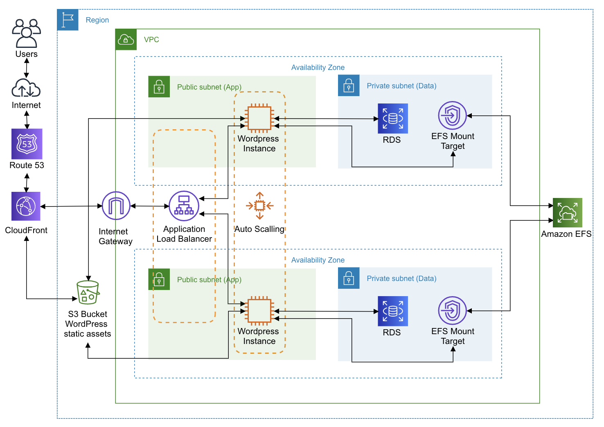

# Hosting WordPress on AWS

Stack to deploy a highly available, scalable, and fault-tolerant WordPress environment using CloudFormation (AWS Free Tier resources default). Based on [WordPress: Best Practices on AWS.](https://aws.amazon.com/blogs/architecture/wordpress-best-practices-on-aws/)

Version 0.5.1 :satellite:

## Overview

This reference architecture provides a YAML template for deploying WordPress on AWS using a set of resources.





## List of Resources
```YAML
#CloudFormation
  AWS::CloudFormation::Interface:

#Compute
  AWS::AutoScaling::AutoScalingGroup
  AWS::AutoScaling::LaunchConfiguration
  AWS::EC2::SecurityGroup
  AWS::EC2::SecurityGroupIngress
  AWS::ElasticLoadBalancingV2::Listener
  AWS::ElasticLoadBalancingV2::LoadBalancer
  AWS::ElasticLoadBalancingV2::TargetGroup

#Storage
  AWS::EFS::FileSystem
  AWS::EFS::MountTarget
  AWS::S3::Bucket

#Security, Identity, & Compliance
  AWS::IAM::InstanceProfile
  AWS::IAM::Role

#Database
  AWS::RDS::DBSubnetGroup
  AWS::RDS::DBInstance

#Networking & Content Delivery
  AWS::CloudFront::Distribution
  AWS::CloudFront::CloudFrontOriginAccessIdentity
  AWS::Route53::RecordSetGroup
```

## Parameters

Name | Description 
------------ | ------
**VpcId** | The VPC ID of an existing VPC 
**Subnet** | The existing subnets 
**Number Of Subnets** | The number of subnets
**EC2 instance type** | WebServer EC2 instance type 
**Key Pair Name** | Name of an existing EC2 KeyPair to enable SSH access to the instances 
**SSHLocation** | The IP address range that can be used to SSH to the EC2 instances 
**Number of Instances** | The initial number of WebServer instances 
**ALB Certificate ARN** | The AWS Certification Manager certificate ARN for the ALB certificate 
**Wordpress DNS** | The main domain name of the WordPress site 
**Database Instance Type** | Database instance class 
**Database Name**| The Amazon RDS master database name. 
**Database User** | The Amazon RDS master username 
**Database Password** | The Amazon RDS master password 
**Performance Mode**| The performance mode of the file system 

## Steps to run

To launch the entire stack and deploy a WordPress site on AWS, click on one of the Launch Stack links below or download the Master template and launch it locally.

You can launch this CloudFormation stack, using your account, in the following AWS Regions:

| AWS Region Code | Name | Launch |
| --- | --- | ---
| us-east-1 |US East (N. Virginia)| [](https://console.aws.amazon.com/cloudformation/home?region=us-east-1#/stacks/new?stackName=WordPress&templateURL=https://wp-cf-project.s3-ap-southeast-2.amazonaws.com/00-wordpress-rootstack.yaml) |
| us-east-2 |US East (Ohio)| [](https://console.aws.amazon.com/cloudformation/home?region=us-east-2#/stacks/new?stackName=WordPress&templateURL=https://wp-cf-project.s3-ap-southeast-2.amazonaws.com/00-wordpress-rootstack.yaml) |
| us-west-2 |US West (Oregon)| [](https://console.aws.amazon.com/cloudformation/home?region=us-west-2#/stacks/new?stackName=WordPress&templateURL=https://wp-cf-project.s3-ap-southeast-2.amazonaws.com/00-wordpress-rootstack.yaml) |
| eu-west-1 |EU (Ireland)| [](https://console.aws.amazon.com/cloudformation/home?region=eu-west-1#/stacks/new?stackName=WordPress&templateURL=https://wp-cf-project.s3-ap-southeast-2.amazonaws.com/00-wordpress-rootstack.yaml) |
| eu-central-1 |EU (Frankfurt)| [](https://console.aws.amazon.com/cloudformation/home?region=eu-central-1#/stacks/new?stackName=WordPress&templateURL=https://wp-cf-project.s3-ap-southeast-2.amazonaws.com/00-wordpress-rootstack.yaml) |
| ap-southeast-2 |AP (Sydney)| [](https://console.aws.amazon.com/cloudformation/home?region=ap-southeast-2#/stacks/new?stackName=WordPress&templateURL=https://wp-cf-project.s3-ap-southeast-2.amazonaws.com/00-wordpress-rootstack.yaml) |

#### :warning: Requirements :warning:

- Certificates (for CloudFront and ELB)
- Key Pair
- Hosted Zone on Route53
- VPC